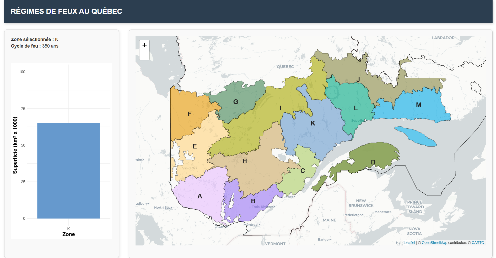

# 🔥 RegimeFeux_shiny

Application **Shiny** pour l'exploration du régime des feux de forêt historiques au Québec.  
Déployée via [shinyapps.io](https://hgesdrn.shinyapps.io/RegimeFeux_shiny/).

---

## 🚀 Aperçu de l'application

L'application permet :

- de visualiser les polygones de feux de forêt par zone ou par période;
- d'explorer l’évolution du régime de feu dans le temps;
- d'interagir avec des graphiques dynamiques;
- de consulter des données résumées par zone ou par année.

---

## 📦 Structure du projet
RegimeFeux_shiny/
├── app.R # Application Shiny principale
├── data/ # Données spatiales et tabulaires utilisées
├── www/ # Éléments visuels (ex. : CSS, images, logo)
├── .github/workflows/ # Fichiers GitHub Actions (déploiement automatique)
├── renv/ # Environnement R verrouillé avec renv
├── renv.lock # Fichier de verrouillage des dépendances R
└── README.md

## 🔄 Déploiement automatique

Le déploiement est déclenché automatiquement lors d’un `git push` sur la branche `main`.  
Il utilise [GitHub Actions](https://github.com/features/actions) et le package [`rsconnect`](https://docs.posit.co/shinyapps/reference/rsconnect.html).

---

